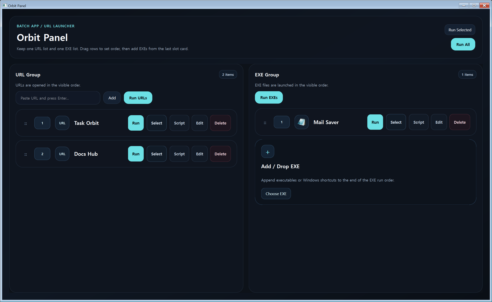

# Orbit Panel

Orbit Panel is a Windows-first productivity launcher built with Python and PySide6.



It manages two ordered groups in one dashboard:

- URL items opened in Chrome
- EXE or `.lnk` items launched from Windows

Each item can also run an optional follow-up script with one of these modes:

- `target_only`
- `target_then_script`
- `script_only`

## Features

- Premium dark dashboard UI with drag reordering
- Separate URL and EXE run groups
- `Run All`, per-group run, and selected-item run
- Windows launch-target add slot with drop overlay
- JSON persistence with automatic restore
- Window size and position restore
- Optional Python script execution per item
- Windows app icon and PyInstaller packaging support

## Requirements

- Windows
- Python 3.10+
- PySide6

Install dependencies:

```bash
pip install -r requirements.txt
```

## Run

```bash
python main.py
```

## Build EXE

Generate or refresh the app icon:

```bash
python tools/generate_app_icon.py
```

Build a packaged Windows executable:

```powershell
powershell -ExecutionPolicy Bypass -File tools/build_release.ps1
```

The packaged executable is written to `dist/Orbit Panel.exe`.

## Releases

Prebuilt Windows executables are published on the GitHub Releases page:

- https://github.com/jinmyeongKim/orbit-panel/releases

## Runtime data

- Source mode stores runtime data under local `config/` and `logs/`
- Frozen EXE mode stores runtime data under `%AppData%\Orbit Panel`

## Scripts

Each item can optionally run:

- no script
- a built-in action
- a Python file path

For real automation, the most useful setup is usually:

- `Run Mode = Script Only` for browser login / web automation
- `Run Mode = Target Then Script` for app launch followed by post-processing
- `Script Type = Python File`

Sample scripts live under `scripts/examples/`.

When a Python file is used, Orbit Panel passes these environment variables:

- `ORBIT_PANEL_ITEM_ID`
- `ORBIT_PANEL_ITEM_TITLE`
- `ORBIT_PANEL_ITEM_TYPE`
- `ORBIT_PANEL_ITEM_TARGET`
- `ORBIT_PANEL_RUN_MODE`
- `ORBIT_PANEL_SCRIPT_TYPE`
- `ORBIT_PANEL_SCRIPT_VALUE`
- `ORBIT_PANEL_ITEM_ENABLED`
- `ORBIT_PANEL_ITEM_CONTEXT`
- `ORBIT_PANEL_BASE_DIR`
- `ORBIT_PANEL_RUNTIME_DIR`
- `ORBIT_PANEL_CONFIG_FILE`
- `ORBIT_PANEL_LOG_DIR`
- `ORBIT_PANEL_HELPERS_DIR` when `scripts/` exists beside the app

Quick starting points:

- `scripts/examples/context_dump.py`
  confirms what Orbit Panel sends into a Python automation
- `scripts/examples/browser_login_stub.py`
  Playwright-based browser automation template for login flows
- `scripts/examples/naver_login.py`
  Naver-focused login automation example driven by environment variables

## License

MIT
